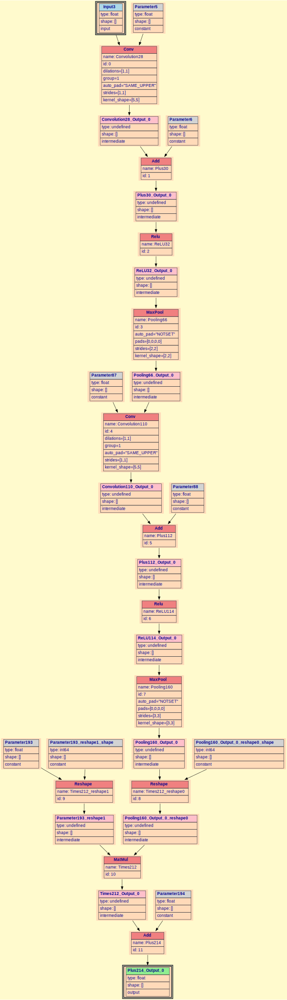

<div align="center">

# Tensor compiler in C++
  
  
  
  
  
</div>

## Table of Contents
- [Running the program](#running-the-program)
- [Using dump](#using-dump)
- [Project structure](#project-structure)
- [Project authors](#project-authors)

## Running the program
Repository cloning, build and compilation is performed using the following commands:

```
git clone git@github.com:BulgakovDmitry/Tensor_compiler.git
cd Tensor_compiler
cmake -S . -B build -DCMAKE_BUILD_TYPE=Release
cmake --build build
```

Program execution is performed in the following format:
```
./build/tensor_compiler <model.onnx>
```

## Using dump
To enable the graph dump option for the `compute graph`, you need to set the `-GRAPH_DUMP` flag, which is disabled by default:
```bash
cmake -S . -B build -DGRAPH_DUMP=ON
```
The constructed `graph` can be viewed in graphical representation using `graphviz`. To generate an image, you can enter:
```bash
dot dump/dump.gv -Tsvg -o dump/dump.svg
```
This produces the following `graph` representation:

<details>
<summary>example of generated graph</summary>
  
<div align="center">
  
</div>

</details>

## Project structure

<details>
<summary>Project structure</summary>

```
.
├── CMakeLists.txt
├── include
│   ├── driver.hpp
│   ├── dump_path_gen.hpp
│   ├── graphviz_dumper.hpp
│   ├── handlers.hpp
│   └── structure
│       ├── attribute.hpp
│       ├── graph.hpp
│       ├── node.hpp
│       └── tensor.hpp
├── onnx
│   └── onnx.proto
└── src
    ├── driver.cpp
    └── main.cpp

```

</details>

## Project authors

<div align="center">

  <a href="https://github.com/RTCupid">
    
  </a>
  <a href="https://github.com/BulgakovDmitry">
    
  </a>
  <br>
  <a href="https://github.com/RTCupid"><strong>@RTCupid, </strong></a>
  <a href="https://github.com/BulgakovDmitry"><strong>@BulgakovDmitry, </strong></a>
  <br>
</div>
