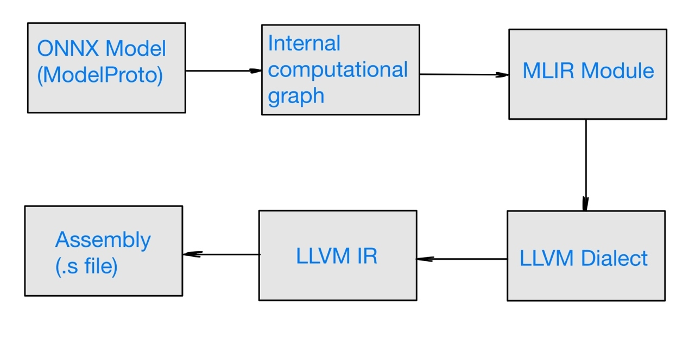
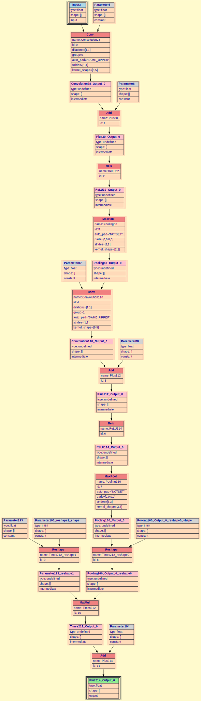

<div align="center">

# ⚔️🐉 Tensor compiler in C++ 🐉⚔️
  
  
  
  
  
  

</div>

## Table of Contents 📖
- [Running the program](#running-the-program)
- [Using dump](#using-dump)
- [Introduction](#introduction)
- [Methodology](#methodology)
- [Project structure](#project-structure)
- [Project authors](#project-authors)

## Documentation 📗
[Documentation](https://bulgakovdmitry.github.io/Tensor_compiler/)

## <a id="running-the-program"></a>Running the program 🛡️
This project expects a working `MLIR/LLVM` build with `MLIRConfig.cmake` available. Repository cloning, build and compilation is performed using the following commands:

```
git clone git@github.com:BulgakovDmitry/Tensor_compiler.git
cd Tensor_compiler
cmake -S . -B build -DMLIR_DIR=/path/to/lib/cmake/mlir -DLLVM_DIR=/path/to/lib/cmake/llvm
cmake --build build
```

Program `execution` is performed in the following format:
```
./build/tensor-compiler <model.onnx>
```


| Option | Description | Default |
|--------|-------------|---------|
| `<input>` | ONNX model file (positional, required) | - |
| `--emit` | Output stage: `mlir`, `llvm`, or `asm` | `asm` |
| `-o <file>` | Output filename for assembly | `a.s` |
| `--mtriple <triple>` | Target triple for codegen | `x86_64-pc-linux-gnu` |
| `-O <0-3>` | Optimization level | `2` |

Usage example: `./tensor-compiler model.onnx --emit=asm -o output.s -O 3`


## <a id="introduction"></a> Introduction 🎍
In the era of deep learning and artificial intelligence, neural networks have become increasingly complex and computationally intensive. While high-level frameworks like PyTorch and TensorFlow provide convenient APIs for designing and training models, they often introduce performance overhead when executing these models in production environments.

Tensor compilers address this critical challenge by transforming high-level neural network descriptions into highly optimized execution code. Unlike traditional compilers that work with scalar values, tensor compilers operate on multidimensional arrays (tensors) and apply domain-specific optimizations that dramatically improve performance and efficiency.

## <a id="methodology"></a> Methodology
The compiler implements a multi-phase pipeline: parsing `ONNX` model into protobuf `ModelProto` and building internal `Graph`, `MLIR` module generation via with dialects (`func`, `arith`, `linalg`, `memref`, `LLVM`, etc.), lowering `MLIR` to `LLVM Dialect`, export `LLVM Dialect` to `LLVM IR`, assembly generation from `LLVM IR` with `O0-O3` optimization and target triple (Fig. 1).

<div align="center"></div><br>
  <div align="center"> Fig 1. Tensor compiler pipeline. </div><br>

## <a id="internal-computational-graph-representation"></a> Internal computational graph representation


## <a id="parsing-onnx-model"></a> Parsing ONNX Model

<details>
<summary>Parsing of ONNX Model:</summary>

```c++
Graph::Graph(const onnx::GraphProto &graph) : name_{graph.name()} {
    for (const auto &initializer : graph.initializer()) {
        auto tensor = handleTensor(initializer);
        addTensor(std::move(tensor));
    }

    for (const auto &input : graph.input()) {
        auto tensor = handleTensor(input, Tensor_kind::input);
        addTensor(std::move(tensor));
        addInput(input.name());
    }

    std::size_t node_idx = 0;
    for (const auto &node : graph.node()) {
        auto new_node = handleNode(node_idx, node);
        addNode(std::move(new_node));
    }

    for (const auto &output : graph.output()) {
        Tensor tensor = handleTensor(output, Tensor_kind::output);
        addTensor(std::move(tensor));
        addOutput(output.name());
    }
}
```
</details>

`ONNX parsing` constructor sequentially processes `initializer`, `input`, `node`, `output` elements from `GraphProto`, creating the internal computational `DAG` with constants, inputs, operators, and outputs.

## <a id="mlir-generation"></a> MLIR generation

## <a id="lowering-mlir-to-llvm-dialect"></a> Lowering MLIR to LLVM Dialect

## <a id="export-llvm-dialect-to-llvm-ir"></a> Export LLVM Dialect to LLVM IR

## <a id="assembly-generation-from-llvm-ir"></a> Assembly generation from LLVM IR

## <a id="using-dump"></a>Using dump 🏰
To enable the graph dump option for the `compute graph`, you need to set the `-GRAPH_DUMP` flag, which is disabled by default:
```bash
cmake -S . -B build -DGRAPH_DUMP=ON
```
The constructed `graph` can be viewed in graphical representation using `graphviz`. To generate an image, you can enter:
```bash
dot dump/dump.gv -Tsvg -o dump/dump.svg
```
This produces the following `graph` representation:

<details>
<summary>example of generated graph</summary>

<div align="center">
  
</div>

</details>

## <a id="project-structure"></a>Project structure 🏯

<details>
<summary>Project structure</summary>

```
.
├── CMakeLists.txt
├── include
│   ├── driver.hpp
│   ├── dump_path_gen.hpp
│   ├── graphviz_dumper.hpp
│   ├── handlers.hpp
│   └── structure
│       ├── attribute.hpp
│       ├── graph.hpp
│       ├── node.hpp
│       └── tensor.hpp
├── onnx
│   └── onnx.proto
└── src
    ├── driver.cpp
    └── main.cpp

```

</details>

## <a id="project-authors"></a>Project authors 🧙‍♂️

<div align="center">

  <a href="https://github.com/RTCupid">
    
  </a>
  <a href="https://github.com/BulgakovDmitry">
    
  </a>
  <br>
  <a href="https://github.com/RTCupid"><strong>@RTCupid, </strong></a>
  <a href="https://github.com/BulgakovDmitry"><strong>@BulgakovDmitry, </strong></a>
  <br>
</div>
